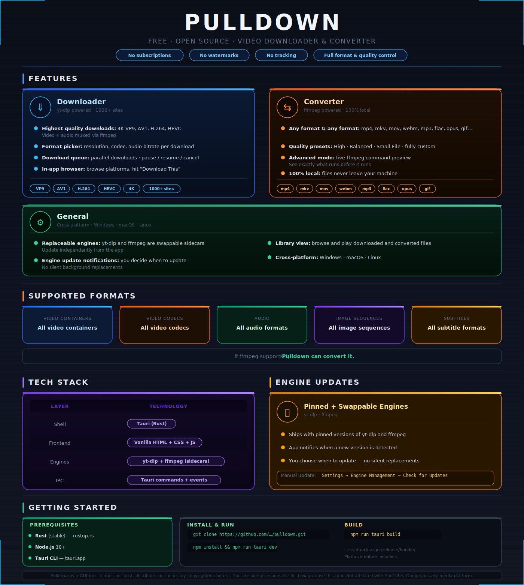

# **Pulldown**

**Free, open-source video downloader & converter.**

Pulldown is a desktop GUI wrapper around [yt-dlp](https://github.com/yt-dlp/yt-dlp) and [ffmpeg](https://ffmpeg.org/). Download videos from YouTube, Vimeo, Twitter, Reddit, and [1000+ other sites](https://github.com/yt-dlp/yt-dlp/blob/master/supportedsites.md) at full quality. Convert any local video or audio file to any format.

> *No subscriptions. No watermarks. No tracking. Full authority over format and quality.*

  

> Downloading copyrighted material without authorization may violate the Terms of Service of the platform and applicable law. **You are solely responsible for how you use this tool.**

### License

MIT © 2025 — see [LICENSE](LICENSE)

  Built with yt-dlp · ffmpeg · Tauri

